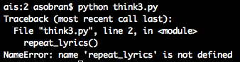
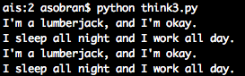

3.1:

3.2:
The program runs as normal.

3.3 - 3.5:

###Exercise 4

Running `think4.py` will open 6 windows with each of the flowers and each of the pies.  

4.2:
Images of the flowers are shown below:

4.3: 
Images of the pies are shown below:

