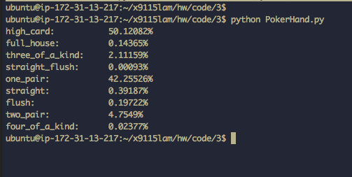

##Exercise 10.8 Birthday Paradox, Demonstrate has_duplicates and calcualte probability from sampling:

##18.12:Exercise 6 (Poker!)
Got fairly close to the theoretical probabilities reported [here](https://en.wikipedia.org/wiki/List_of_poker_hands).  Output from test run on AWS over 10 million decks:
