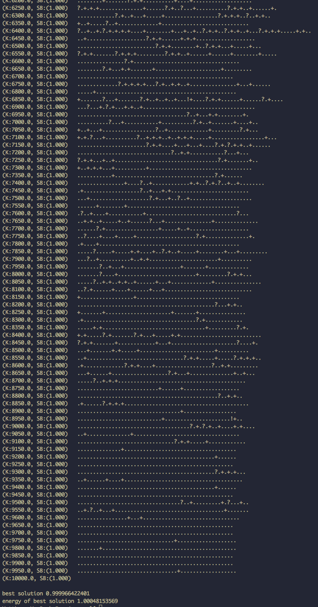

#Simulated Annealing

We used the "from hell" method Dr. Menzies discussed in class for energy.  We are using a kmax value of 10,000 so output extends for a long time, so we have included a screenshot of the last 4,000 or so output lines:

Full output can be found in out.txt.