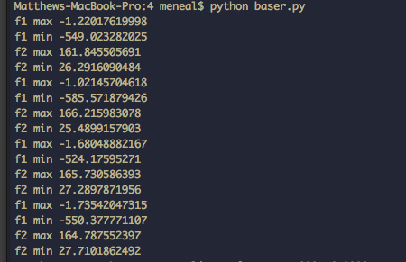

For reading the output, T is the retry number that we are on in the iterations.  Each retry lasts for 1000 changes, then we take the best solution out of that retry and add it as our best if it is the best overall.  

In the body of the output a plus indicates that we have a better solution than where we were at our last mutation, and an exclamation mark indicates that we have a best so far in this particular run.

SB is the best solution for a particular try, EB is the energy of that best solution. We are calculating energy 'From Hell' from hell but normalizing to a range from 0 to 1.  So best energy should be 1.

Finally SBO at the end of the run is the best solution overall and EBO is the best energy overall.

We moved our baseline run out to a separate file caled baser.py.  We ran the baseline study for 10,000 iterations 4 times to get the values that are now hardcoded into MaxWalkSat.py.  The output of baser is shown below:

We are running the MaxWalkSat for 1000 retries and for 1000 changes for each retry in the below output.

Our output for this program is in [out.txt](./out.txt).  