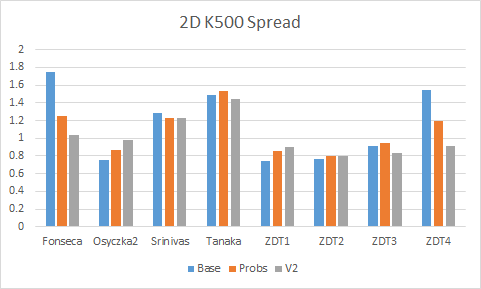
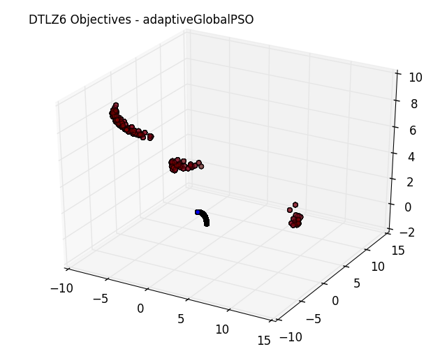
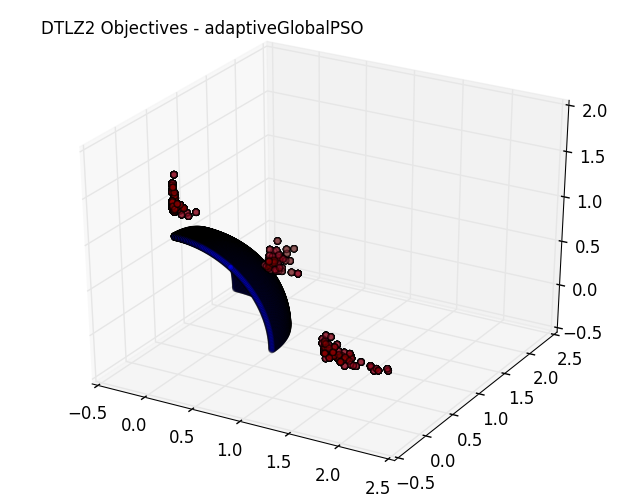

# CSC 591 Final Project Report #

# Introduction #
Particle swarm optimization (PSO) is an optimization technique inspired by the "murmurations" of swarms of birds. Each candidate in a PSO swarm relies on its own knowledge of the domain space as well as the collective knowledge of the swarm. The simple baseline implementation of PSO provided by the authors [1] to first coin the technique leaves plenty of opportunities for the addition of heuristics, which may improve the performance of PSO. We experimented with a few tweaks and heuristics to see if they give better results than the classical version by Kennedy and Eberhart. The two heuristics we implement include a probabilistic reinforcement learning inspired method and a particle repulsion method.

# Related Work #
## The Classical Model ##
The origins of PSO and its "classical" implementation are provided by Kennedy and Eberhart [1](http://www.cs.tufts.edu/comp/150GA/homeworks/hw3/_reading6%201995%20particle%20swarming.pdf). Each candidate is at a random position in decision space, and moves via a change in position due to its velocity, which can change every timestep. The velocity is determined by a few factors. The first is the best position that each candidate has visited, stored in `pbest`. The second is the best position that has ever been visited by any candidate, stored in `gbest`. Third is the candidate's current position `presentx`. Fourth is a stochastic measure which the authors coin as "craziness". Last is the candidate's current velocity `vx`, which helps preserve the candidate's momentum.

The local and global best each have the same weight so they affect the new velocity the same. The authors opened this area up for future researchers to find optimal weights. The "craziness" factor is multiplied by two so candidates will overshoot the goal about half the time.

## The Adaptive Model ##
In the classical model, there is equal weight given to the local best (aka the cognitive learning rate) and the global best (aka the social learning rate). Yuhui Shi and Russell Eberhart [2](http://dsp.szu.edu.cn/pso/ispo/download/a%20modified%20pso.pdf) developed an inertia weight 'w' factor to balance the local and global search to obtain better performance.

In 2002, Maurice Clerc and James Kennedy [3](http://ieeexplore.ieee.org/xpl/login.jsp?tp=&arnumber=985692&url=http%3A%2F%2Fieeexplore.ieee.org%2Fiel5%2F4235%2F21241%2F00985692) explored PSO from the particle's perspective and gained some unique insights, one of which was the introduction of constriction coefficients to keep the particles together. They experimented with constriction on a few benchmark functions and were able to find minima on some very complex functions, on up to thirty dimensions.

## Parameter Tuning ##
Due to the many parameters of classical PSO, tuning these parameters is a must to get good results. A well-known paper by Anthony Carlisle and Gerry Dozier [4](https://github.com/timm/sbse14/wiki/etc/pdf/Off-The-Shelf_PSO.pdf) does just that. Their goal was to give recommendations for the parameters that future researchers could use as a good baseline to get up and running. They found that a good population size was 30, a global neighborhood was better than a local neighborhood, asynchronous updates were less costly than synchronous updates,

#Main#

## IBEA ##

The overall dominance structure of our implementations of PSO were based on the [IBEA](http://www.tik.ee.ethz.ch/sop/publicationListFiles/zk2004a.pdf) paper by Zitler.  Our code is as follows:

```python
def dominate(model, setOfPos, pruning=10):
    max_index = 0
    while len(setOfPos) > pruning:
        objs = [model.cal_objs(pos) for pos in setOfPos]
        expoSumList = list()
        for i in xrange(len(objs)):
            diffVect = [[objs[j][k]\
            - objs[i][k] for k in xrange(len(objs[i]))] for j in xrange(len(objs)) if j != i]
            diffList = [max(v) for v in diffVect]
            diffListExpo = [-math.exp(-val/k) for val in diffList]
            expoSum = sum(diffListExpo)
            expoSumList.append(expoSum)
        min_index, min_value = min(enumerate(expoSumList), key=operator.itemgetter(1))
        max_index, max_value = max(enumerate(expoSumList), key=operator.itemgetter(1))
        setOfPos.pop(min_index)
    if max_index == len(setOfPos):
        max_index -= 1
    tmp = setOfPos[0]
    setOfPos[0] = setOfPos[max_index]
    setOfPos[max_index] = tmp
    return setOfPos
```

The algorithm works by calculating the differences between all of the objective dimensions of a frontier member vs all other members of the frontier.  Those values are put into a list and the maximum is found.  Then it raises the maximums to a power of e and sums them.  That value is used as a comparison against the other positions in the frontier.  Members of the set of positions are removed based on which is worst, then the process is rerun until the set of positions is of a length equal to the pruning parameter.

This process is used twice in each run. First it is used against a list of personal bests for each particle.  At initialization each particle is created with a random list of 10 positions.  On each change the current position of the particle is added to its list of personal bests.  The personal best list for each particle is run through IBEA and pruned from 11 to 10 members.  

Once the personal bests have all been run a global frontier is run through IBEA, that frontier is made up of a set of 10 positions that are either arrived at randomly on the first run, or are left over from the last run.  In addition to that set of 10 positions are another 30 positions that are taken as the best positions from each particle's personal best list.  When the set of positions are sent in to IBEA there are 40 positions and those positions are pared to 10.

##Objective Minimum Maximum Update##
We use a continuous objective minimum maximum update in each run. We prime with 10 vectors and if the new maximum or minimum is encountered the overall minimum and maximum is updated.


##Novel Heuristics##

###Probablistic###

The heuristic replaces the personal best value with a probabilistic decision for the overall best particle. This is an extension of reinforcement learning.

The basic premise involves maintaining a list of probabilities as member for each particle. The length of this list is the number of particles in the whole swarm and represent all the other particles in the swarm. Each member of the list is a probability representing how well the particle did when using that particle as a personal best in the velocity update function. Below is code for this representation:

```python
class Probs(object):
    def __init__(s, numOfParticles, scaling=0.9):
        uniform = 1.00 / numOfParticles
        s.particleProbs = [uniform] * numOfParticles
        s.scaling = scaling

    def increaseProb(s, index):
        oldProb = s.particleProbs[index]
        newProb = oldProb/s.scaling
        if(newProb >= 1.0):
            newProb = 0.9999
        sumOfOldProbs = sum(s.particleProbs) - oldProb
        scalingFactor = (sumOfOldProbs - (newProb - oldProb))/sumOfOldProbs
        s.particleProbs = [x * scalingFactor for x in s.particleProbs]
        s.particleProbs[index] = newProb

    def decreaseProb(s, index):
        oldProb = s.particleProbs[index]
        newProb = oldProb * s.scaling
        sumOfOldProbs = sum(s.particleProbs) - oldProb
        scalingFactor = (sumOfOldProbs + (oldProb - newProb))/sumOfOldProbs
        s.particleProbs = [x * scalingFactor for x in s.particleProbs]
        s.particleProbs[index] = newProb

    def getParticle(s):
        r = random.random()
        probSum = 0.0
        for i in xrange(len(s.particleProbs)):
            probSum = probSum + s.particleProbs[i]
            if probSum > r:
                return i
        return i

    def printProbs(s):
        print s.particleProbs
```

Each particle has on associated Prob object. To initialize we have a uniform probability for selecting another particle for the update function. The scaling factor is a discounting factor for increasing and decreasing probabilities. Initially the first particle selected by each particle is random according the uniform distribution. If the energy of that particle is better after the update the probabilities will be increased so the likelihood selecting that particle during the next position update is increased. Similarly, if the energy is worse the probabilities are decreased as it becomes less likely that particle is selected during the next update phase. During particle selection the particles associated with better energies are more likely to be selected and those associated with worse energies are less likely selected. Conceptually this creates a personal global best for each particle. Below is a summary of the process:

```
	Initialize all probabilities uniformly

    Loop
    	Radomly select particle as pbest
        Update position
        Is position better than before:
        	Increase probability of selecting this particle
        Is position worse than before:
        	Decrease probability of selecting this particle   

```

###V2 - Repulsion###

In adaptive PSO particles will usually converge and lead to a less diverse pareto frontier. The electron repulsion heuristic is used to keep particles separated and exhibit more divergent behavior while also maintaining the useful properties of adaptive PSO. Each particle repulses other particles based on Coulomb's law so the repulsion is inversely proportional to the distance between the particles. After each update of position each particle goes through a repulsion loop for each particle and gets slightly nudged away from other particles. There is an additional mechanism to increase the radius(weight) of a particle if it gets too close to another particle to increase the repulsion. Below is the code to handle this logic:

```python
def distance(v1, v2):
    return sum([(a + b)**2.0 for a, b in zip(v1, v2)])**(1/2.0)

def repulsion(c1, c2, radius):
    constant = 2.0
    force = constant * c1.radius * c2.radius / (radius**2.0)
    return force
```

Below is the repulsion loop which runs after adaptive PSO position update:

```python
for c in st.s:
    if c.uniq in uniqTracker:
        continue
    else:
        radius = distance(c.pos, can.pos)

        if(radius < baseRadius):
            newRadius = (c.radius + can.radius)**(0.5)
            c.radius = newRadius
            can.radius = newRadius

        repulsedVelocity = repulsion(c, can, radius)
        can.vel = [repulsedVelocity * vmax + vel for vel in can.vel]
        can.pos = [pos + vel for pos, vel in zip(can.pos, can.vel)]
        for i in xrange(len(can.pos)):
            can.pos = model.singleRetry(can.pos, i)
        c.vel = [-repulsedVelocity * vmax + vel for vel in c.vel]
        c.pos = [pos + vel for pos, vel in zip(c.pos, c.vel)]
        for i in xrange(len(c.pos)):
            c.pos = model.singleRetry(can.pos, i)
```

## Metrics ##

The overall metric structure used was a combination of the canonical metrics used for many papers in the field: Spread, Hypervolume, and Convergence. True Pareto Frontiers were taken from [jMetal](http://jmetal.sourceforge.net/problems.html).

### Convergence ###

Convergence is described in the [Deb](http://www.tik.ee.ethz.ch/sop/publicationListFiles/zk2004a.pdf) paper on NSGA II.  The calculation is the minimum Euclidean distance from each member of the frontier to the true pareto frontier, averaged over the entire front.  The idea is to minimize this calculation, since a value close to zero means that we are essentially on the pareto frontier.  The advantage of this calculation is that we can encapsulate the information shown in our graphs of frontiers and true frontiers in one metric.

### Spread ###

Spread, is also mentioned in the [Deb](http://www.iitk.ac.in/kangal/Deb_NSGA-II.pdf) paper on NSGA-II as the diversity metric.  It is a calculation of whether the calculated frontier is covering the entire region of the the true frontier.  The calculation is also a minimization, with a high uniformity in the population of the front yielding a value of zero.  Our implementation is borrowed from [AI4SE](https://github.com/ai-se/Spread-HyperVolume) with an external batch runner added on top of it to automate running models.

### Hypervolume ###

Hypervolume is a calculation of the volume of the area dominated by the frontier.  For most of our models this is a 2 or 3 dimensional hypercube.  There are a large number of different implementations for hypervolume and there is little consensus about what calculation is the best.  Our implementation is again borrowed from [AI4SE](https://github.com/ai-se/Spread-HyperVolume).  Their implementation is based on the implementation in this paper by [Fonseca](http://lopez-ibanez.eu/doc/FonPaqLop06-hypervolume.pdf).

# Experimental Process #

We ran each of the optimizers containing the novel heuristics with 30 retries and either 100 or 500 changes. Each run generated a series of output files. One file contained a listing of metrics for each model in the run. Another file contained a list of frontiers, each for one of the models. Finally, a series of graphs were generated for each model: one containing the decision space and another containing the objective space. The graphs containing objective values also contained the "true" pareto frontier from [jMetal](http://jmetal.sourceforge.net/problems.html).

## Parameters ##

We have used phi_1=3.8 and phi_2=2.2 for a total constriction value of near 0.25.  Starting out we used values that were defined in [Off the Shelf PSO](https://github.com/timm/sbse14/wiki/etc/pdf/Off-The-Shelf_PSO.pdf), phi_1=2.8, phi_2=1.3.  Those parameters ended up leaving us with velocities that were high enough that particles were consistently flying out of the hyperspace.  Our implementation of PSO immediately kills all particles that go outside of the hyperspace and reinitializes them at random points in the hyperspace.  

The large number of killed particles caused our performance to be incredibly low, so instead of sticking with that implementation we simply increased both phi1 and phi2 by 1 to increase the constriction factor.  This resulted in substantially better performance across the board for all optimizers. No metrics are presented here to show that difference, mostly because performance was so poor prior to this change that we did not keep anything from that point in our implementation process.

As far as other parameters, we left our number of particles at 30 for all of our optimizers.  For iterations and retries we were set to 30 retries and 500 iterations, and 30 retries and 100 iterations.  We were able to go with a lower number of iterations because we actually wrote the output of each retry into a master frontier that was output for each overall run.  So in reality our runs of optimizers with 30 retries and 500 iterations are all aggregated into 15,000 iterations for each model and each optimizer.

#Results and Analysis#

##2d Objective 500 Step Run##


###Convergence###
The convergence for both heuristics was generally worse than the base adaptive PSO model. Interestingly, the V2repulsion heuristic performed much better on Tanaka, Srinivas, and ZDT3.


###Hypervolume###
The probabilistic heuristic outperformed both of the other PSOs on  every model.


###Spread###
Spread performance varied based on model with some of the optimizers doing better than others.

##3d Objective 500 Step Run##


###Convergence####
The probability and V2 heuristics had worse convergence on DTLZ1-3, but better convergence on DTLZ4-7 and on Viennet2 and 3.


###Hypervolume###
The probability heuristic had a hypervolume than the base optimizer, but the V2 heuristic had lower hypervolume, especially with DTLZ5-7 and Viennet2 and 3.


###Spread###
As in the 2D objectives, there was no optimizer which consistently had a higher or lower spread than another.

##2d Objective 100 Step Run##


###Convergence####
One interesting observation to note is that Fonseca had an extremely low convergence, meaning that the frontiers of all three optimizers converged to the true pareto frontiers. For the other models, the base optimizer has the lowest convergence, followed by the probability heuristic and then the V2 heuristic.


###Hypervolume###
The base optimizer generally had the lowest hypervolume, followed by the probability heuristic and then the V2 heuristic.


###Spread###
There is again a mix, with no optimizer that has a consistently higher or lower spread than the others.

##3d Objective 100 Step Run##


###Convergence####
For most of the models, the V2 heuristic performed much better than the other optimizers. But on DTLZ3, V2 had a significantly higher convergence.


###Hypervolume###
The probability heuristic was consistently slightly higher than the base optimizer. The V2 heuristic was slightly higher than the other two for DTLZ3, but was strangely very low for the rest.


###Spread###
As with all the other configurations, all three optimizers had around the same spread, with none consistently higher or lower than the other two.

##Objective Space Analysis##

###DTLZ1 Objective Space###


Comparing these two graphs of the objectives for DTLZ1 shows that the probabilistic heuristic came much closer to the to the pareto frontier(in blue) than the base adaptive global PSO. This can be seen by the scale of the axis.

###DTLZ6 Objective Space###





Here we observe probs producing much right clumps than the base adaptive method. 

###DTLZ2 Objective Space###




The probabilistic heuristic optimizing DTLZ2 shows this same phenomenon of clumping and overall getting better results for spread, convergence, and hypervolume.

Pictures of all our runs are available in the .


# Threats to Validity #
##Internal Validity##
Because we append the list of frontiers for each retry to our global list, and then we run the metrics on this cumulative list. Normally each retry would add an element of variance to running the optimizers, but because of the fact that each retry is another input into a larger frontier we do not get the benefit of running multiple retries and starting from random positions for entire fronts.  This makes our evidence more thin than it should be for the amount of sheer run time that we ran the optimizers.   

Also, because we dynamically adjust the objective minimum and maximum values, and the hypervolume metric values were calculated from the normalized mins/maxs, the hypervolume values may not be consistent across optimizers. This problem is brought on in any situation where the output from the optimzier is a normalized front.  Luckily only one of our metrics actually uses a normalized front, Hypervolume. Furthermore, the Hypervolume metric does not use a normalized front for DTLZ, so at least those metrics are shielded from this issue.

## External Validity ##
We only ran the models with either two or three objectives. Today however, there is more focus on testing optimizers with a high number of objectives. We believe that running our optimizers with two and three objectives serves as a baseline which shows some improvement over Adaptive PSO. Also, we were able to visualize the results more easily than with more than three objectives, and can get a better understanding of how our heuristics improve PSO's performance.

Another threat is the fact that we have relied on true frontier data from jMetal.  It seems unlikely that these frontiers are incorrect, but we did find some odd inconsistencies on performance against the true frontiers posted on their site.  A good example of that can be found at this [link](https://github.com/LambdaConglomerate/x9115lam/blob/master/project/pics/PSOProbsK500.0ZDT1Objectives.png),  The true frontier from jMetal is shown in grey below the frontier found by our Probabilistic PSO implementation.  This seemed to be a boundary for all of our optimizers, that made us wonder whether jMetal may have implemented ZDT1 differently than we did.  In any cases where our implementation of models deviated from jMetal our metrics would have validity issues.

As mentioned above, all of the metrics that we used other than convergence were written by other teams, so any inconsistencies or issues in their code would also affect our own work.   

#Future Work#
The heuristics we used added complexity to the PSO algorithm. Future work could decrease this complexity. For example, the probability heuristic could be implemented without probability measurements but instead a count for each particle indicating its usefulness. Negative values could be associated with particles that make energy worse while positive values could indicate a particle makes and energy better. And instead of taking a probabilistic determination for best particle take the max of the values. This could decrease the complexity of the algorithm.

Future work could include using these heuristics in other versions of PSO including classical PSO.  We implemented the beginnings of those PSO's in our
repo.  We believe that overall our setup could be used as a test harness to work on a large number of different PSO heuristic implementations.  The running of the system, logging, metric orchestration, and quality of the test harness itself could be improved considerably with more time and effort.

#Conclusions#

We have demonstrated two unique heuristics of PSO adapting them to adaptive PSO with IBEA domination. The probabilistic heuristic and V2-repulsion showed promising results and increased the performance of certain aspects of the optimizer. We have also shown certain optimizers are useful for certain models and the no free lunch theorem holds.

#Appendix#

## Running the rig ##
The rig has a number of tunable parameters to change how each run is orchestrated.  test.py contains most of those parameters:

- num_retries and num_changes are self explanatory. If changes are made, they need to be set to floats.

- line 18 has the set of models to run, this can either be an array of individual models, or the defined sets of Two_D_List, and Three_D_List. The reason for splitting into 2D and 3D lists is the fact that the hypervolume calculation cannot handle combinations of 2d and 3d fronts.

- line 19 has the optimizer to use valid options are: PSOv2, adaptiveGlobalPSO, PSOProbs.

- The main run loop for the entire rig is in run.sh. It is run with the following command: ```sh run.sh -x <<NAME_OF_OUTPUT_FILE>>```, a file of that name will be output in both the out folder and the metrics/out folder.


# References
[1] - [Particle Swarm Optimization, Kennedy et al](http://www.cs.tufts.edu/comp/150GA/homeworks/hw3/_reading6%201995%20particle%20swarming.pdf)

[2] - [A modified Particle Swarm OPtimizer, Shi et al](http://dsp.szu.edu.cn/pso/ispo/download/a%20modified%20pso.pdf)

[3] - [The particle swarm - explosion, stability, and convergence in a multidimensional complex space, Clerc et al](http://ieeexplore.ieee.org/xpl/login.jsp?tp=&arnumber=985692&url=http%3A%2F%2Fieeexplore.ieee.org%2Fiel5%2F4235%2F21241%2F00985692)

[4] - [An Off the Shelf PSO, Carlisle et al](https://github.com/timm/sbse14/wiki/etc/pdf/Off-The-Shelf_PSO.pdf)

[5] - [Indicator Based Multiobjective Search, Zitler et al](http://www.tik.ee.ethz.ch/sop/publicationListFiles/zk2004a.pdf)

[6] - [A Fast and Elitist Multiobjective Genetic Algorithm: NSGA-II, Deb et al](http://www.iitk.ac.in/kangal/Deb_NSGA-II.pdf)

[7] - [An Improved Dimension-Sweep Algorithm for the Hypervolume Indicator](http://lopez-ibanez.eu/doc/FonPaqLop06-hypervolume.pdf)

[8] - [jMetal](http://jmetal.sourceforge.net/problems.html)
